+++
date = "2026-05-17T13:37:58+10:00"
draft = true
title = "Laptop Power on Charge Mod"
description = "Modding my laptop to boot when the charger is plugged in"
author = "nextredo"
categories = ["hardware"]
tags = ["hacking-modding"]
series = []
featured_image = ""
toc = true
weight = 1
+++

# Laptop Power On Charger Attach Mod
## Background
In February 2026, I received and [old Acer laptop (released 2016)][acer-aspire-f-15-f5-f73g] from a friend.
As someone who'd started homelabbing, this seemed like a great little server machine.
- It has a whopping **3 drive slots** (good for 2 drives in RAID 1 and a 3rd as a boot disk)
  - 1x M.2 SATA
  - 1x 2.5" SATA
  - 1x hidden 2.5" SATA (if you swap the DVD drive for an [optical bay HDD caddy][hdd-caddy-aliexpress])
- It has a [good enough processor][intel-i5-7500u] (2 core, 2.70 GHz base)
- It has a fair bit of RAM, [especially for today's economy][wikipedia-ram-shortage] (16 GiB)
- It's a laptop, so it's power efficient
- It's a laptop, so it has built-in battery backup

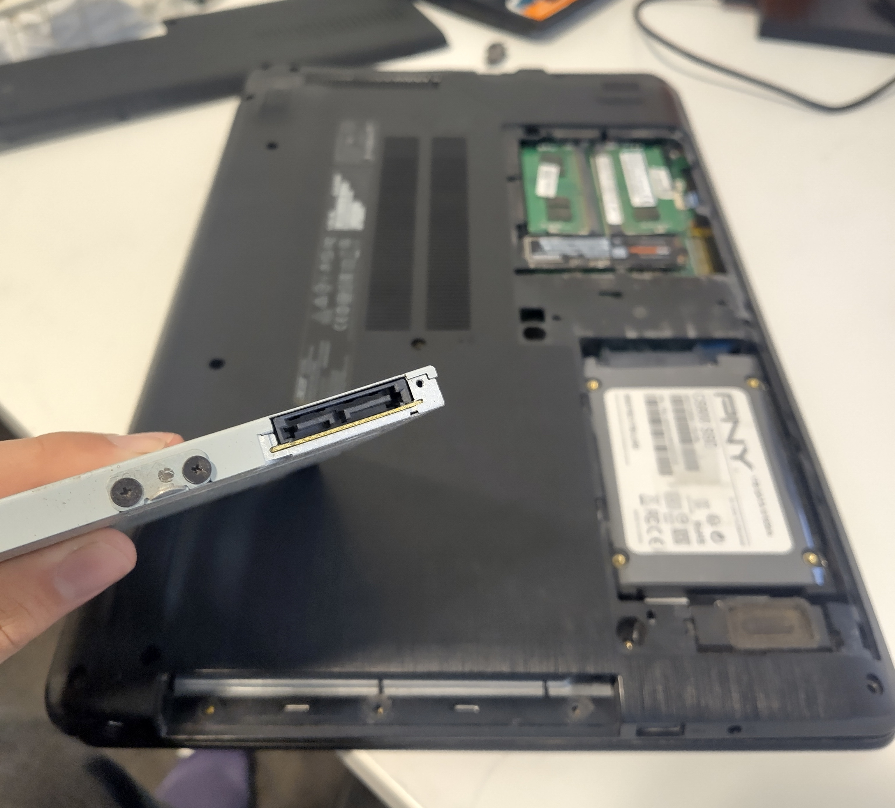
*The laptop with the service panel open. The removed optical drive connector is in the foreground, the 2 other drives are in the background.*

So... what's the catch?

## The catch
<!-- TODO BIOS settings pic or gif -->

Digging around the BIOS, I noticed that there were very few settings.
There was no "battery charge limiter", which is great for a machine that will be charging 24/7.
But most notably, there was no "Power on AC Attach" setting to automatically boot when the charger is connected.

This poses an issue.

What if the power goes out, the laptop drains its battery, and then the power comes back on?
I assume the answer would be that it just wouldn't turn back on.

Annoyingly, this setting is common on many other laptops, including [my other homelab laptop][lenovo-yoga-260].

<!-- TODO Yoga 260 BIOS with AC wake option selected -->

### Trying to overcome this
I investigated a few ways to overcome this - each of which (and why they failed) is below:

##### Maybe a newer BIOS version has that functionality?
Maybe. I tried looking for one on Acer's website - but the [driver search page][acer-driver-search] wouldn't accept my laptop's serial number, or any of the ones I found online.
It also **stupidly** doesn't just have info & downloads without needing an S/N.
Thankfully I somehow made it to the [driver download page][acer-driver-downloads] anyway.

Weirdly though, I did find some [information online][acer-bios-1.27] that indicates later BIOSes (at least v1.27) exist for this machine.
But since I can't find or install any of them, this idea is "myth busted".

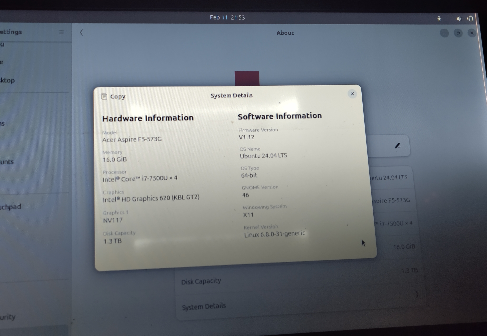
*Seen from an Ubuntu live USB boot, my unit has a BIOS v1.12.*

##### Use Wake On LAN?
One setting that the BIOS actually does have is "Wake on LAN".
I thought about using this, but that'd require having either a router or other computer to wake it from sleep.
Maybe an Arduino, maybe a Raspberry Pi, maybe it'd be automatic, maybe it'd be manual.
Either way, I decided this was a bit of a pain and wouldn't be the option I go with.

##### Just get a new computer bro?
Well yeah, I could. But where's the fun in that?

Plus, this way I'm not just creating more e-waste, and I get to write [a cool post](#) about it.

##### How about modding it?
That might just work.
Could use a solenoid to push the power button, relays to simulate it.

Following this bright spark of an idea, I turned to the web and ended up where all good ideas start - reddit *(not)*.

[This post][reddit-post] sounded pretty promising, so I got to work.

## Modding it
### The plan
Like the post says, I planned to have 2 relays - a 24v one and a 5v one.
- The 24v relay (normally open) is powered by the charger. It shorts the power button when triggered.
- The 5v relay (normally closed) is powered by the USB. It disconnects the 24v relay's coil when triggered.

This way, we *should* have the following sequence of events:
1. The power cable is plugged in
2. This closes the 24v relay, shorting the power button
3. The laptop begins to turn on
4. The USB ports become powered
5. This opens the 5v relay, disconnecting the 24v relay, which opens the power button
6. Laptop boots as normal

### Getting the parts
I already had a cheap "Arduino 5v relay module", so all I needed was the 24v one.
It was easy to find at a local electronics store.
I already had other things like wire, a soldering station & materials, a multimeter etc.

First thing I made sure to check was that it actually activated consistently with the 19v charger.
Seemed to work ok.

### Wait, where's the power button?
Unlike most laptops, this laptop's power button is part of the keyboard.
<!-- TODO keyboard pic -->

This is a pain, because I assume it means the power button is connected to the motherboard through the keyboard connector,
so its PCB traces will be less obvious than if the power button was standalone.

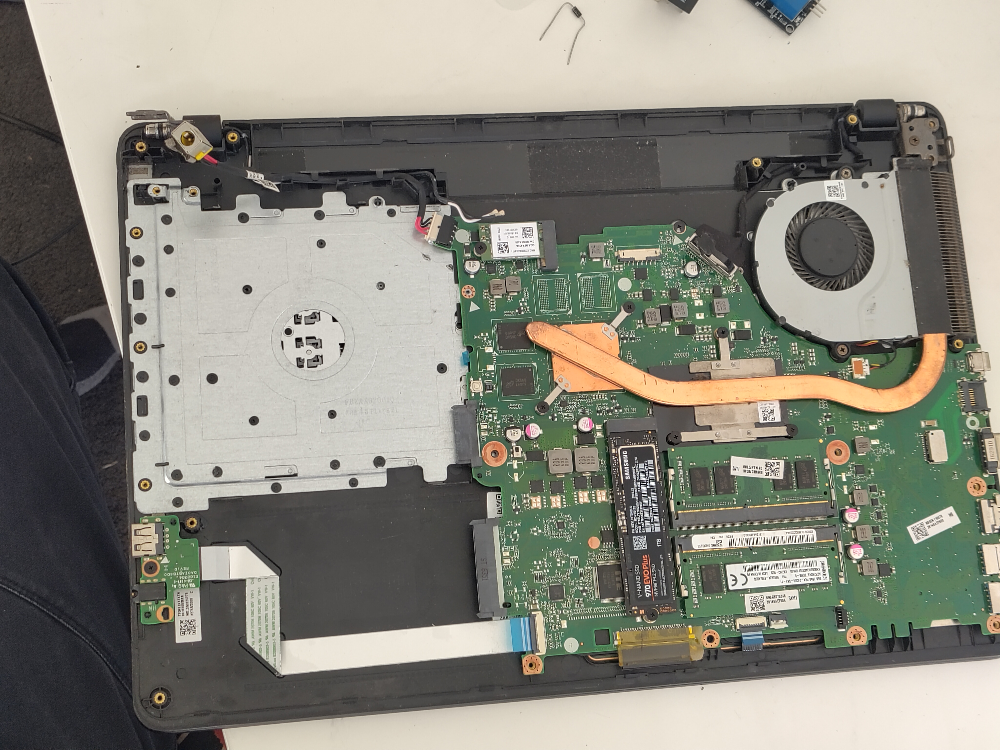
*The motherboard of the laptop, as seen with the bottom shell removed.*

Upon opening the laptop, I looked for the keyboard connector.
I assumed it'd be a cable with a lot of pins somewhere, and one at the bottom of the mobo fit that description nicely.
I watched a keyboard replacement video for some ideas on how to find the power button PCB traces, but it also showed me the keyboard connector.

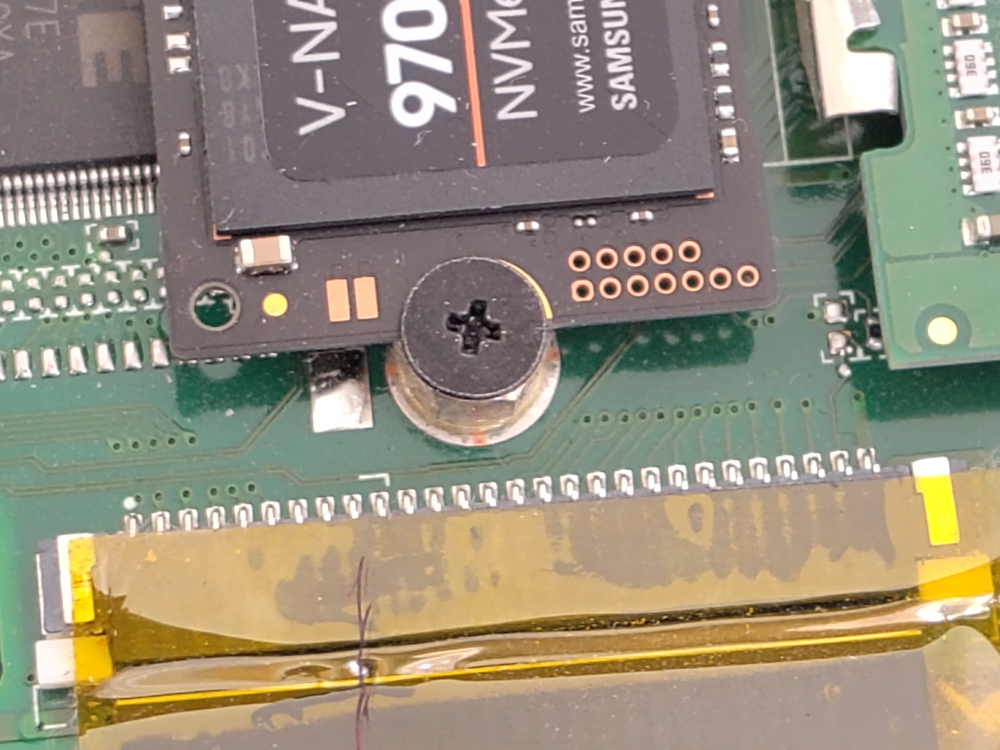
*The keyboard connector.*

Looking at the connector, I noticed 2 pins on the right edge of it that had different looking PCB traces to the others.
Since I assumed the power button wouldn't be part of the normal keyboard interface
(nor would it be routed to the same spot on the mobo), I checked for continuity between the two pins with my multimeter.
Toggling the power button on and off while doing so, I found that the pins were open-circuit when not pressed, and about 236Ω when pressed.

I double checked this was actually the power button by shorting the two by hand (with a 225Ω resistor). Sure enough, the laptop turned on.

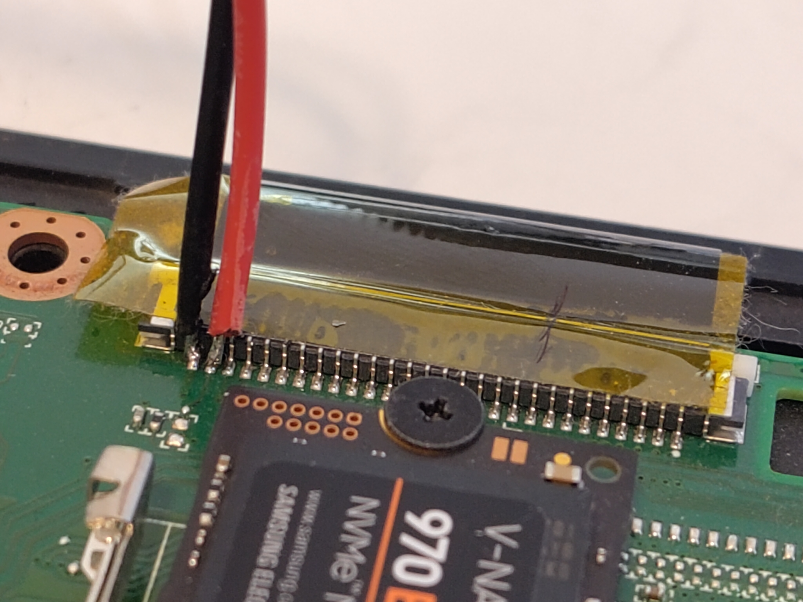
*The keyboard connector, with the power button traces hijacked.*

### Now where's the power come from?
This part wasn't so hard, since the charging barrel jack goes straight to a nice big connector on the mobo.

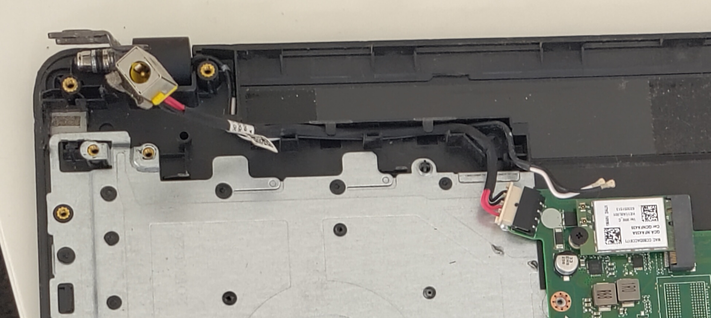
*The charging port's connection to the mobo.*

### Wiring it up
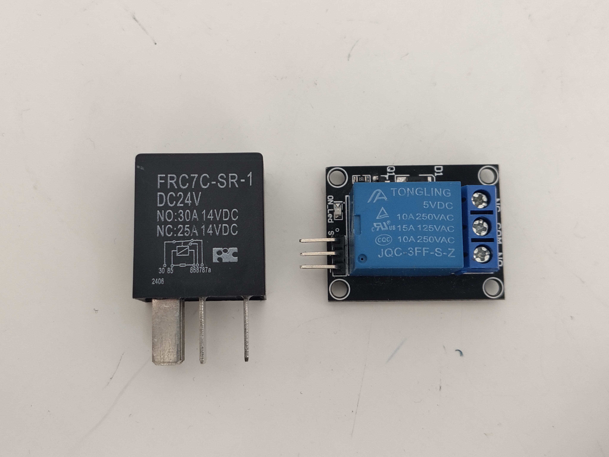
*The two relays. The cryptic pin numbers for the 24v relay correspond to inscriptions next to the pins.*

#### 5v relay connections
| Relay pin | Laptop connection | Relay pin use |
|---|---|---|
| s | USB +5v | Signal - for controlling the relay coil |
| + | USB +5v | Power - for providing power to the module |
| - | USB ground | Ground - power's other half |
| NC | Charger +19v | Normally closed - the pin of the relay's "switch" end that is connected to COM when the relay coil is off |
| NO | N/A | Normally open - the opposite of NC (connected to COM when the coil is on) |
| COM | The 24v relay's positive coil input | Common - the central part of the relay's "switch" end |

#### 24v relay connections
| Relay pin | Laptop connection | Relay pin use |
|---|---|---|
| Pin 30 (COM) | Power button - | See above table |
| Pin 85 (Coil +) | Charger - | One end of the relay coil |
| Pin 86 (Coil -) | Charger + (via the 5v relay's COM-NC pathway) | The other end of the relay coil |
| Pin 87 (NO) | Power button + | See above table |
| Pin 87a (NC) | N/A | See above table |

So, I soldered it up and hot glued the tiny flimsy connections so they (hopefully) wouldn't snap off and short things.

I put connectors everything, so I could remove the relays if I wanted it to be a normal laptop again, and so I could
remove/reinstall the bottom shell easily.

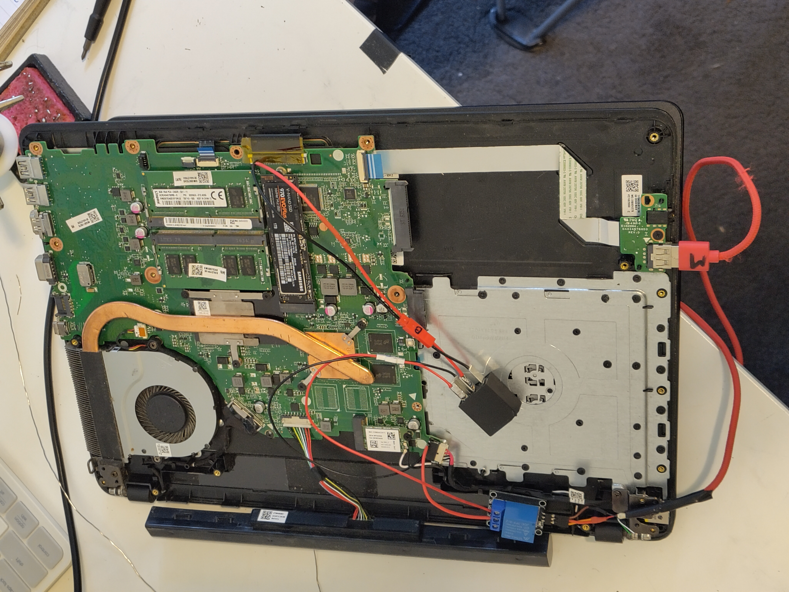
*The mobo with both relays installed.*

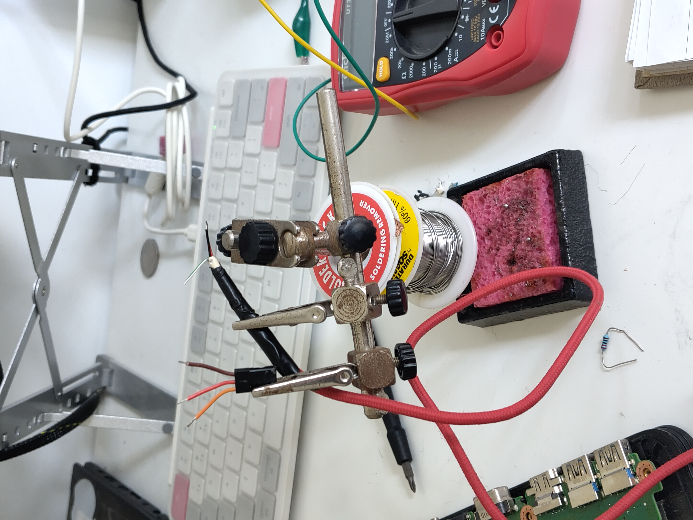
*Soldering the USB to relay connection.*

## Fini
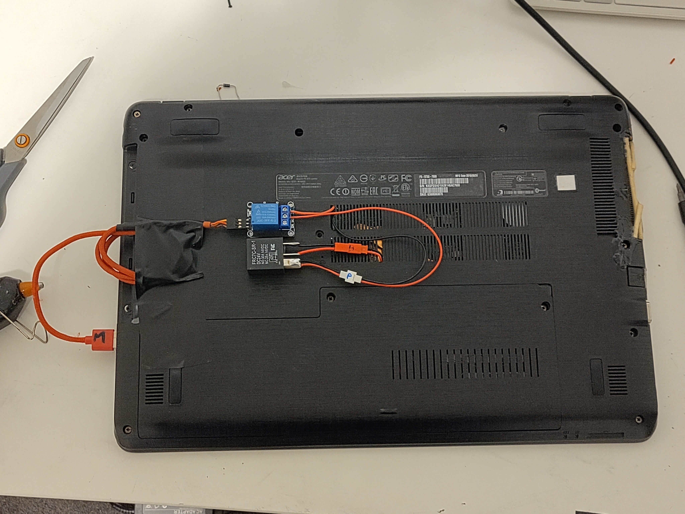
*The laptop, all modded and reassembled.*
*Don't mind the terrible attempt to repair the fan grille in the right of frame - this laptop has seen better days.*

Yay, it works!
Few tests with the shell off, and a few with it on, it all looks good to me (even despite me sparking the 19v charge rails once - oops).

## Problem?
Well the relay mod works fine.

**But...**

Turns out I didn't actually have to do this 🤦‍♂️.
While searching around, I discovered that Acer laptops have a *hidden advanced BIOS menu*.
If you boot the laptop and enter the BIOS while holding `Fn + Tab`, you get access to the power and "advanced" tabs in the BIOS.

While these didn't explicitly have a "Power on AC" option that I was hoping for - they had 2 substitutes that work just fine instead.

### "State after G3" Setting
Buried deep in the "Advanced" tab, this setting dictates what state the system goes into after "G3" (mechanical off).
Based on some loose googling, this appears to dictate what the laptop does after a power failure - like running out of battery.
The options are "S0" and "S5" states - which correspond to sleep and full-on respectively.

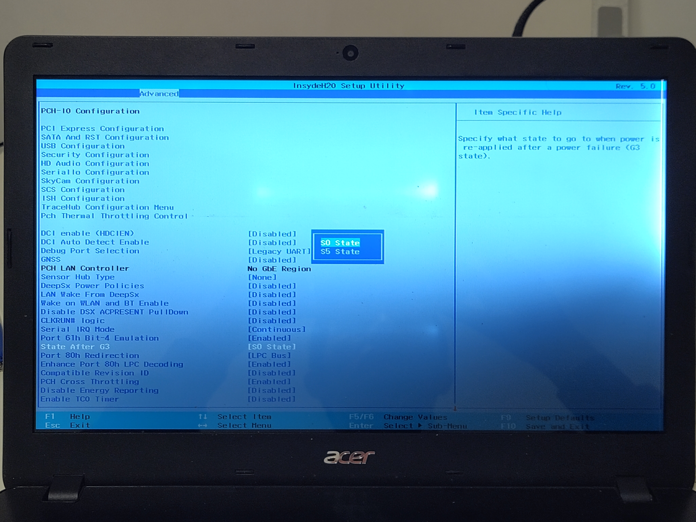
*The "State after G3" setting. The screen is a little busted, hence the dark corner.*

Naturally, we want it to boot after power failure, so S5 it is.
You can [read more about the state terminology here][microsoft-g-states].

### "Auto Wake on S5" Setting
This setting is a bit more obvious to find, and is the real holy grail we're looking for.
One of the options for this setting is "By Every Day" - which allows us to boot the computer with an RTC alarm.
So, at a specific time each day, the computer will boot itself.

This means that we essentially can have the computer auto-boot on power, since as long as it has power, it'll try
and boot once a day. Combined with the boot after power-loss, and we've got ourselves a good server setup.

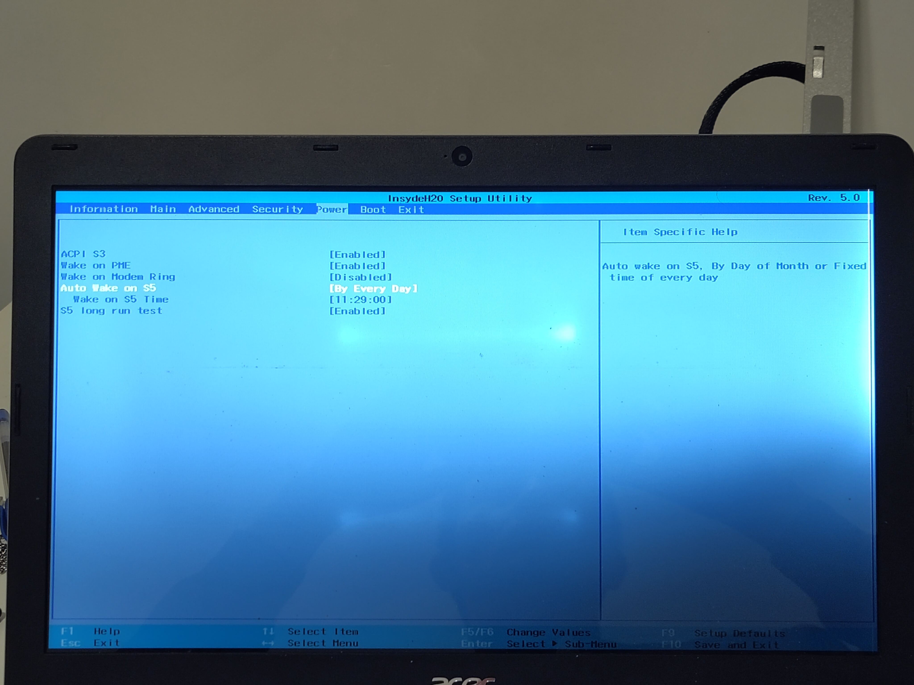
*The "Auto Wake on S5" setting.*

## Fini - Part 2

Welp - time to remove all the relays so it sits nicer on my desk :)

At least I got a cool blog post out of it.

<!-- TODO
- [ ] Reply to the Reddit post
  - Link this static site blog post
  - Thank bro

try this advanced BIOS settings hack thing
https://community.acer.com/en/discussion/551722/wake-on-lan-aspire-v5-573g

Artificial sloptelligence summary:
Step-by-Step GuidePower Off: Shut down your Acer Aspire F5-573G completely.Apply Key Combination: Press and hold the Fn + Tab keys simultaneously, and tap the Power button once.Reboot and Enter BIOS: As the laptop turns on, immediately release the Fn + Tab keys and press F2 repeatedly to enter the standard BIOS screen.Access Advanced Mode: Once inside the standard BIOS, hold the Fn + Tab keys again and press the Power Button until it turns off. Turn the laptop back on, release the buttons, and repeatedly press F2. The Advanced tab should now be available at the top of the screen.
-->

<!-- Links -->
[acer-aspire-f-15-f5-f73g]: https://laptopmedia.com/au/review/acer-aspire-f-15-f5-573g-a-big-step-forward/
[hdd-caddy-aliexpress]: https://www.aliexpress.com/item/1005002573524607.html
[intel-i5-7500u]: https://www.intel.com/content/www/us/en/products/sku/95451/intel-core-i77500u-processor-4m-cache-up-to-3-50-ghz/specifications.html
[wikipedia-ram-shortage]: https://en.wikipedia.org/wiki/2024%E2%80%93present_global_memory_supply_shortage
[lenovo-yoga-260]: https://web.archive.org/web/20160818005603/http://shop.lenovo.com/us/en/laptops/thinkpad/yoga-series/yoga-260/
[acer-bios-1.27]: https://community.acer.com/en/discussion/538838/bios-upgrade-to-latest-1-27-acer-aspire-f5-573g-no-mssd-present-and-battery-not-working
[acer-driver-search]: https://www.acer.com/au-en/support/drivers-and-manuals
[acer-driver-downloads]: https://www.acer.com/au-en/support/product-support/Aspire_F5-573G
[reddit-post]: https://www.reddit.com/r/homelab/comments/14swppq/comment/mpd7dqp/?utm_source=share&utm_medium=mweb3x&utm_name=mweb3xcss&utm_term=1
[microsoft-g-states]: https://learn.microsoft.com/en-us/windows/win32/power/system-power-states
